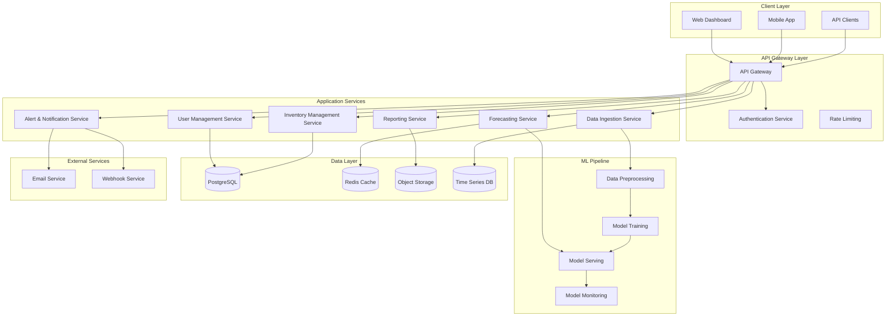

# Design Document: AI-Powered Demand Forecasting and Inventory Optimization System

## Overview

The AI-powered demand forecasting and inventory optimization system is designed as a cloud-native SaaS platform that helps small and mid-scale retail businesses make data-driven inventory decisions. The system leverages machine learning algorithms to analyze historical sales and inventory data, generate accurate demand forecasts, and provide actionable recommendations for inventory management.

The architecture follows a microservices approach with API-first design principles, ensuring scalability, maintainability, and easy integration with existing retail systems. The platform emphasizes user experience for non-technical users while maintaining robust backend capabilities for accurate forecasting and real-time decision support.

## Architecture

### High-Level Architecture



### Microservices Architecture

The system is decomposed into focused microservices, each handling specific business capabilities:

**Core Services:**
- **User Management Service**: Handles authentication, authorization, user profiles, and multi-tenant data isolation
- **Data Ingestion Service**: Processes CSV uploads, validates data quality, and manages historical data storage
- **Forecasting Service**: Orchestrates ML model execution, manages forecast generation, and caches predictions
- **Inventory Management Service**: Tracks current inventory levels, calculates reorder points, and manages product catalogs
- **Alert & Notification Service**: Monitors inventory thresholds, sends notifications, and manages alert preferences
- **Reporting Service**: Generates analytics reports, exports data, and provides dashboard metrics

**ML Pipeline Services:**
- **Data Preprocessing Service**: Cleans and transforms raw data for model training
- **Model Training Service**: Trains and validates forecasting models using ensemble approaches
- **Model Serving Service**: Provides real-time inference capabilities for demand predictions
- **Model Monitoring Service**: Tracks model performance, detects drift, and triggers retraining

### Technology Stack

**Backend Services:**
- **Runtime**: Python 3.11+ with FastAPI framework for high-performance APIs
- **Database**: PostgreSQL for transactional data, InfluxDB for time series data
- **Caching**: Redis for session management and forecast caching
- **Message Queue**: Apache Kafka for asynchronous processing and event streaming
- **Container Orchestration**: Kubernetes for service deployment and scaling

**Machine Learning Stack:**
- **Core Libraries**: scikit-learn, pandas, numpy for data processing
- **Time Series Forecasting**: Prophet (Meta), ARIMA/SARIMA, LSTM neural networks
- **Model Management**: MLflow for experiment tracking and model versioning
- **Feature Store**: Feast for feature management and serving
- **Model Serving**: TensorFlow Serving for high-performance inference

**Frontend Technologies:**
- **Web Application**: React.js with TypeScript for type safety
- **Mobile**: React Native for cross-platform mobile support
- **Visualization**: D3.js and Chart.js for interactive dashboards
- **State Management**: Redux Toolkit for predictable state management

**Infrastructure:**
- **Cloud Platform**: AWS with multi-region deployment capability
- **API Gateway**: AWS API Gateway with custom authentication
- **Storage**: Amazon S3 for file storage, EBS for database volumes
- **Monitoring**: Prometheus and Grafana for system monitoring
- **Logging**: ELK Stack (Elasticsearch, Logstash, Kibana) for centralized logging

## Components and Interfaces

### Data Ingestion Component

**Purpose**: Handles CSV file uploads, validates data quality, and transforms raw data into standardized formats.

**Key Interfaces:**
```python
class DataIngestionService:
    def upload_sales_data(self, file: UploadFile, retailer_id: str) -> UploadResult
    def upload_inventory_data(self, file: UploadFile, retailer_id: str) -> UploadResult
    def validate_data_format(self, data: DataFrame) -> ValidationResult
    def transform_data(self, raw_data: DataFrame) -> ProcessedData
```

**Data Validation Rules:**
- Required fields: product_id, date, quantity, price (for sales data)
- Date format validation and timezone handling
- Duplicate record detection and handling
- Data type validation and automatic conversion
- Business rule validation (positive quantities, valid dates)

### Forecasting Engine Component

**Purpose**: Generates demand predictions using ensemble machine learning models with configurable forecast horizons.

**Model Architecture:**
The system employs an ensemble approach combining multiple forecasting algorithms:

1. **ARIMA/SARIMA Models**: Capture linear trends and seasonal patterns in historical data
2. **Prophet Model**: Handles holidays, seasonality, and trend changes with interpretable components
3. **LSTM Neural Networks**: Learn complex non-linear patterns and long-term dependencies
4. **XGBoost Regressor**: Captures feature interactions and handles external variables

**Key Interfaces:**
```python
class ForecastingEngine:
    def generate_forecast(self, product_id: str, horizon_days: int) -> ForecastResult
    def train_models(self, historical_data: TimeSeriesData) -> ModelTrainingResult
    def evaluate_model_accuracy(self, model_id: str) -> AccuracyMetrics
    def get_forecast_confidence(self, forecast: ForecastResult) -> ConfidenceInterval
```

**Ensemble Strategy:**
- Weight models based on historical accuracy for each product category
- Use cross-validation to determine optimal model combinations
- Implement dynamic model selection based on data characteristics
- Provide uncertainty quantification through prediction intervals

### Inventory Optimization Component

**Purpose**: Calculates optimal reorder points, safety stock levels, and generates actionable recommendations.

**Optimization Algorithms:**
- **Economic Order Quantity (EOQ)**: Minimizes total inventory costs
- **Safety Stock Calculation**: Uses service level targets and demand variability
- **Reorder Point Optimization**: Considers lead times and demand uncertainty
- **ABC Analysis**: Prioritizes products by revenue impact and turnover rates

**Key Interfaces:**
```python
class InventoryOptimizer:
    def calculate_reorder_point(self, product_id: str) -> ReorderPoint
    def generate_recommendations(self, retailer_id: str) -> List[ReorderRecommendation]
    def identify_slow_moving_inventory(self, retailer_id: str) -> List[SlowMovingItem]
    def optimize_safety_stock(self, product_id: str, service_level: float) -> SafetyStock
```

### Alert Management Component

**Purpose**: Monitors inventory levels, detects threshold breaches, and sends timely notifications.

**Alert Types:**
- **Low Stock Alerts**: Triggered when inventory falls below reorder points
- **Stockout Predictions**: Early warnings based on forecast and current levels
- **Slow-Moving Inventory**: Identifies products with low turnover rates
- **Forecast Accuracy Degradation**: Alerts when model performance drops

**Key Interfaces:**
```python
class AlertManager:
    def monitor_inventory_levels(self, retailer_id: str) -> List[Alert]
    def send_notification(self, alert: Alert, preferences: NotificationPreferences) -> bool
    def configure_thresholds(self, retailer_id: str, thresholds: AlertThresholds) -> bool
    def get_alert_history(self, retailer_id: str, days: int) -> List[AlertHistory]
```

### User Interface Component

**Purpose**: Provides intuitive dashboards and interfaces for non-technical retail users.

**Dashboard Features:**
- **Executive Summary**: Key metrics, forecast accuracy, inventory turnover
- **Demand Forecasts**: Interactive charts with confidence intervals and trend analysis
- **Inventory Status**: Current levels, reorder recommendations, alert summaries
- **Performance Analytics**: Model accuracy trends, cost savings, stockout prevention

**Key Interface Elements:**
- Drag-and-drop file upload with progress indicators
- Interactive forecast charts with zoom and filter capabilities
- One-click action buttons for accepting recommendations
- Mobile-responsive design for on-the-go access
- Contextual help and guided tours for new users

## Data Models

### Core Data Entities

**Retailer Entity:**
```python
class Retailer:
    id: UUID
    name: str
    email: str
    subscription_tier: SubscriptionTier
    created_at: datetime
    settings: RetailerSettings
    
class RetailerSettings:
    default_lead_time_days: int
    default_service_level: float
    currency: str
    timezone: str
    notification_preferences: NotificationPreferences
```

**Product Entity:**
```python
class Product:
    id: UUID
    retailer_id: UUID
    sku: str
    name: str
    category: str
    unit_cost: Decimal
    selling_price: Decimal
    supplier_info: Optional[SupplierInfo]
    created_at: datetime
    
class SupplierInfo:
    name: str
    lead_time_days: int
    minimum_order_quantity: int
    contact_info: str
```

**Sales Transaction Entity:**
```python
class SalesTransaction:
    id: UUID
    retailer_id: UUID
    product_id: UUID
    transaction_date: datetime
    quantity_sold: int
    unit_price: Decimal
    total_amount: Decimal
    channel: SalesChannel  # online, in_store, marketplace
```

**Inventory Record Entity:**
```python
class InventoryRecord:
    id: UUID
    retailer_id: UUID
    product_id: UUID
    recorded_date: datetime
    quantity_on_hand: int
    reserved_quantity: int
    available_quantity: int
    location: Optional[str]
```

**Forecast Entity:**
```python
class DemandForecast:
    id: UUID
    retailer_id: UUID
    product_id: UUID
    forecast_date: datetime
    horizon_days: int
    predicted_demand: List[DemandPrediction]
    confidence_interval: ConfidenceInterval
    model_used: str
    accuracy_score: Optional[float]
    
class DemandPrediction:
    date: datetime
    predicted_quantity: float
    lower_bound: float
    upper_bound: float
```

**Recommendation Entity:**
```python
class ReorderRecommendation:
    id: UUID
    retailer_id: UUID
    product_id: UUID
    generated_date: datetime
    recommended_quantity: int
    urgency_score: float
    reasoning: str
    estimated_cost: Decimal
    status: RecommendationStatus  # pending, accepted, rejected, expired
```

### Time Series Data Schema

**Sales Time Series:**
```python
class SalesTimeSeries:
    timestamp: datetime
    retailer_id: UUID
    product_id: UUID
    daily_sales_quantity: int
    daily_revenue: Decimal
    moving_average_7d: float
    moving_average_30d: float
    seasonality_factor: float
```

**Inventory Time Series:**
```python
class InventoryTimeSeries:
    timestamp: datetime
    retailer_id: UUID
    product_id: UUID
    stock_level: int
    days_of_supply: float
    turnover_rate: float
    stockout_risk: float
```

### Model Metadata Schema

**Model Performance Tracking:**
```python
class ModelPerformance:
    model_id: UUID
    retailer_id: UUID
    product_category: str
    training_date: datetime
    accuracy_metrics: AccuracyMetrics
    feature_importance: Dict[str, float]
    hyperparameters: Dict[str, Any]
    
class AccuracyMetrics:
    mae: float  # Mean Absolute Error
    mape: float  # Mean Absolute Percentage Error
    rmse: float  # Root Mean Square Error
    r2_score: float  # R-squared
    directional_accuracy: float  # Percentage of correct trend predictions
```

## Correctness Properties

*A property is a characteristic or behavior that should hold true across all valid executions of a system—essentially, a formal statement about what the system should do. Properties serve as the bridge between human-readable specifications and machine-verifiable correctness guarantees.*

Before defining the correctness properties, I need to analyze the acceptance criteria from the requirements to determine which ones are testable as properties.

### Property 1: Data Upload Validation
*For any* CSV file uploaded to the system, the validation process should correctly identify valid records for import and provide specific error messages for invalid records, with successful uploads displaying accurate record counts.
**Validates: Requirements 1.1, 1.2, 1.3, 1.4**

### Property 2: Historical Data Sus:**
- Minimum 90% code coverage requirement for new features
- All property-based tests must pass with zero failures
- Performance regression detection with automatic alerts
- Security vulnerability scanning integrated into test pipelinety-based tests run on every code change with full 100-iteration cycles
- Unit tests execute in parallel for fast feedback
- Integration tests run on staging environment deployments
- Performance tests execute nightly with trend analysis

**Test Data Management:**
- Synthetic data generation for consistent test environments
- Production data anonymization for realistic testing scenarios
- Test data versioning to ensure reproducible test results
- Automated test data cleanup and refresh procedures

**Quality Gateng:**
- End-to-end workflows from data upload through forecast generation
- API contract testing with external systems
- Database transaction integrity and rollback scenarios
- Email notification delivery and webhook triggering

**Performance Testing:**
- Load testing for concurrent user scenarios
- Stress testing for large dataset processing
- Scalability testing for multi-tenant scenarios
- Response time validation for dashboard loading

### Continuous Testing Pipeline

**Automated Test Execution:**
- Proper    assert forecast is not None
    assert forecast.confidence_interval is not None
    assert forecast.considers_seasonality == True
    assert len(forecast.predictions) > 0
```

### Unit Testing Balance

**Focused Unit Testing:**
- Avoid excessive unit tests since property-based tests handle comprehensive input coverage
- Focus on specific integration scenarios and known edge cases
- Test concrete examples that illustrate expected behavior
- Validate error handling for specific failure modes

**Integration Testidata)
    else:
        assert result.success == False
        assert len(result.error_messages) > 0
        assert all(is_specific_error(msg) for msg in result.error_messages)

@given(product=product_strategy(), historical_data=sufficient_data_strategy())
def test_forecast_generation_completeness_property(product, historical_data):
    """Feature: demand-forecasting-system, Property 3: Forecast Generation Completeness"""
    forecast = forecasting_engine.generate_forecast(product.id, historical_data)
    
 Test Examples:**

```python
@given(sales_data=sales_data_strategy(), file_format=csv_format_strategy())
def test_data_upload_validation_property(sales_data, file_format):
    """Feature: demand-forecasting-system, Property 1: Data Upload Validation"""
    result = data_ingestion_service.upload_sales_data(sales_data, file_format)
    
    if is_valid_format(file_format) and has_required_fields(sales_data):
        assert result.success == True
        assert result.imported_count == count_valid_records(sales_rmat: **Feature: demand-forecasting-system, Property {number}: {property_text}**

**Data Generation Strategies:**
- **Sales Data Generators:** Create realistic sales patterns with seasonality, trends, and noise
- **Inventory Generators:** Generate valid inventory records with various stock levels and product types
- **Configuration Generators:** Create valid retailer settings and threshold configurations
- **Time Series Generators:** Generate historical data with different lengths and characteristics

**Propertyon across system operations and transformations
- Round-trip properties for data serialization and API operations
- Model behavior consistency across different data distributions

### Property-Based Testing Configuration

**Testing Framework:** Hypothesis (Python) for property-based testing with minimum 100 iterations per property test

**Test Organization:**
- Each correctness property implemented as a single property-based test
- Tests tagged with feature name and property reference for traceability
- Tag fohat demonstrate correct behavior for known scenarios
- Edge cases and boundary conditions (empty datasets, maximum file sizes, extreme values)
- Integration points between microservices and external systems
- Error conditions and exception handling paths
- User interface interactions and accessibility compliance

**Property-Based Testing Focus:**
- Universal properties that hold across all valid inputs and configurations
- Comprehensive input coverage through randomized test data generation
- Invariant preservatirrors

**Error Recovery Mechanisms:**
- Auto-save functionality to prevent data loss during errors
- Partial success handling for batch operations
- Rollback capabilities for failed configuration changes
- Clear paths to retry failed operations

## Testing Strategy

### Dual Testing Approach

The system employs a comprehensive testing strategy that combines unit testing and property-based testing to ensure both specific correctness and universal behavior validation.

**Unit Testing Focus:**
- Specific examples twith exponential backoff
- Database connectivity: Implement connection pooling and automatic reconnection
- File storage errors: Provide alternative storage options and retry mechanisms

### User Experience Error Handling

**Progressive Error Disclosure:**
- Show summary errors first, with option to view detailed information
- Provide actionable error messages with suggested corrections
- Implement inline validation to catch errors before submission
- Offer contextual help and documentation links for complex eProvide confidence intervals and uncertainty quantification

### System Integration Errors

**API Error Handling:**
- Rate limiting: Return HTTP 429 with retry-after headers
- Authentication failures: Provide clear error messages without exposing security details
- Malformed requests: Return detailed validation errors with correction suggestions
- Service unavailability: Implement circuit breaker patterns with graceful degradation

**External Service Errors:**
- Email delivery failures: Queue notifications for retry nd Model Errors

**Insufficient Data Errors:**
- Graceful degradation: Use ensemble methods when individual models fail
- Clear warnings: Inform users when data is insufficient for reliable forecasting
- Fallback strategies: Implement simple moving averages when ML models cannot be trained

**Model Performance Errors:**
- Accuracy degradation: Automatically trigger retraining when accuracy drops below thresholds
- Training failures: Log detailed error information and notify administrators
- Prediction errors:  type mismatches: Provide clear guidance on expected data types
- File size violations: Inform users of the 50MB limit and suggest data splitting strategies

**Data Validation Errors:**
- Invalid dates: Reject records with malformed or future dates
- Negative quantities: Flag and exclude records with negative inventory or sales values
- Duplicate records: Detect and handle duplicate entries with user confirmation
- Inconsistent product IDs: Validate product references against existing catalog

### Forecasting aical data is insufficient.
**Validates: Requirements 10.3, 10.4**

### Property 24: Concept Drift Detection
*For any* significant change in sales patterns, the system should detect concept drift and adapt model behavior accordingly.
**Validates: Requirements 10.6**

## Error Handling

### Data Quality and Validation Errors

**File Upload Errors:**
- Invalid file formats: Return specific error messages indicating expected CSV format
- Missing required fields: Identify and list all missing required columns
- Data should continuously monitor accuracy against actual sales data and provide performance metrics to administrators.
**Validates: Requirements 10.1, 10.5**

### Property 22: Automatic Model Retraining
*For any* product where forecast accuracy drops below 80%, the system should trigger automatic model retraining.
**Validates: Requirements 10.2**

### Property 23: Model Categorization and Ensemble Methods
*For any* product category, the system should maintain separate models and use ensemble methods when histor
### Property 19: Webhook Integration Support
*For any* configured webhook, the system should trigger notifications with proper formatting for real-time integration scenarios.
**Validates: Requirements 9.3**

### Property 20: Bulk API Operations
*For any* bulk data operation through the API, the system should handle the request correctly regardless of data volume within reasonable limits.
**Validates: Requirements 9.6**

### Property 21: Model Performance Monitoring
*For any* forecasting model in use, the systemts and modifications.
**Validates: Requirements 7.4, 7.5**

### Property 17: API Functionality and Security
*For any* API request, the system should provide proper authentication, rate limiting, and return correctly formatted responses for all supported endpoints.
**Validates: Requirements 9.1, 9.4**

### Property 18: Data Export Consistency
*For any* data export request, the system should generate properly formatted CSV files containing accurate forecasts and recommendations.
**Validates: Requirements 9.2**
in accessibility features including keyboard navigation.
**Validates: Requirements 6.5, 6.6**

### Property 15: Actionable Recommendations Presentation
*For any* situation requiring retailer action, the system should present prioritized recommendations with one-click action capabilities.
**Validates: Requirements 6.4**

### Property 16: Role-Based Access Control
*For any* user attempting to access data or functionality, the system should enforce role-based permissions and maintain audit logs of all access attempendations provided.
**Validates: Requirements 5.3, 5.5**

### Property 13: Dashboard Content Completeness
*For any* dashboard view, key metrics (forecast accuracy, inventory turnover, stockout risk) should be displayed with clear visualizations, explanations, and contextual help available for technical terms.
**Validates: Requirements 6.1, 6.2, 6.3**

### Property 14: User Interface Responsiveness
*For any* screen size or device type, the interface should adapt appropriately with responsive design and maintadashboard interface.
**Validates: Requirements 4.6**

### Property 11: Inventory Analysis Calculations
*For any* product with sales data, the system should calculate inventory turnover rates and correctly identify slow-moving items based on defined time periods and seasonal considerations.
**Validates: Requirements 5.1, 5.2, 5.4**

### Property 12: Slow-Moving Inventory Ranking
*For any* set of slow-moving inventory items, they should be ranked by financial impact (total value tied up) with appropriate recommle supplier information, reorder recommendations should include preferred supplier details.
**Validates: Requirements 3.6**

### Property 9: Alert Generation Logic
*For any* inventory level that falls below defined thresholds or is predicted to stock out within 7 days, appropriate alerts should be generated with correct priority levels.
**Validates: Requirements 4.1, 4.5**

### Property 10: Dashboard Notification Accessibility
*For any* alert condition, corresponding notifications should be accessible through the any* set of reorder recommendations, they should be properly ordered by urgency (days until stockout) and revenue impact.
**Validates: Requirements 3.3**

### Property 7: Configuration Persistence
*For any* retailer configuration changes (safety stock levels, lead times, alert thresholds, slow-moving thresholds), the settings should be properly stored and applied in subsequent calculations.
**Validates: Requirements 3.5, 4.4, 5.6**

### Property 8: Supplier Information Integration
*For any* product with availab valid forecast horizon selection (7, 14, or 30 days), the system should generate predictions for the specified time period with appropriate accuracy metrics.
**Validates: Requirements 2.4, 2.6**

### Property 5: Reorder Recommendation Logic
*For any* product approaching its reorder point, the system should generate recommendations that consider lead times, safety stock, and demand forecasts, with clear reasoning provided.
**Validates: Requirements 3.1, 3.2, 3.4**

### Property 6: Recommendation Prioritization
*For fficiency Warning
*For any* dataset with less than 90 days of historical data, the system should warn retailers about potential forecast accuracy limitations.
**Validates: Requirements 1.6**

### Property 3: Forecast Generation Completeness
*For any* product with sufficient historical data (≥90 days), the system should generate demand forecasts that include confidence intervals and consider seasonality patterns.
**Validates: Requirements 2.1, 2.2, 2.3**

### Property 4: Forecast Horizon Flexibility
*For any*